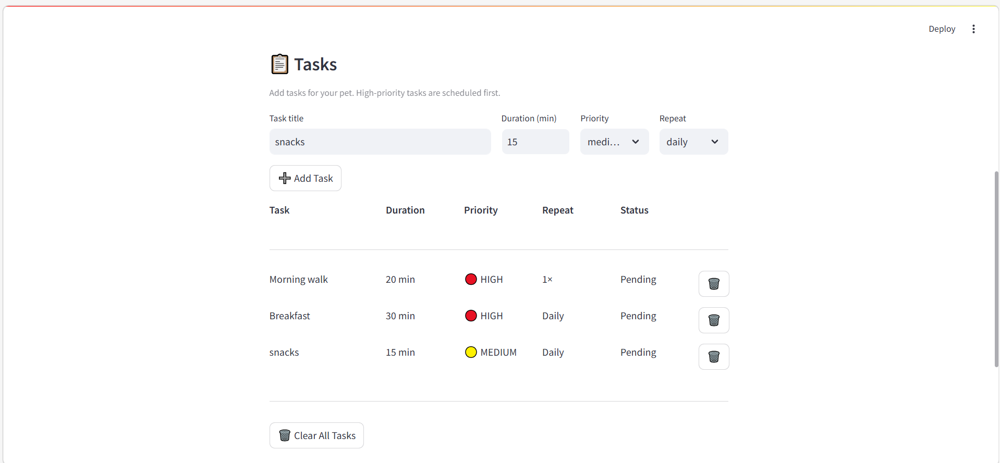
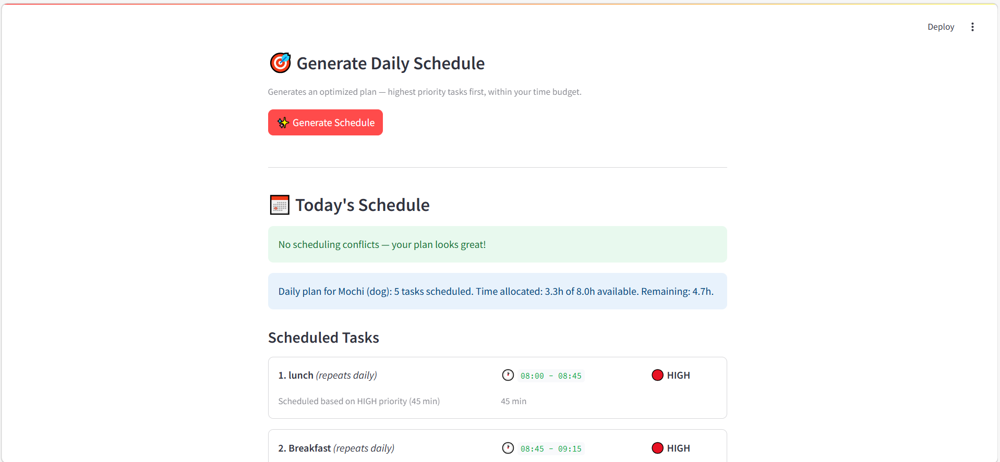
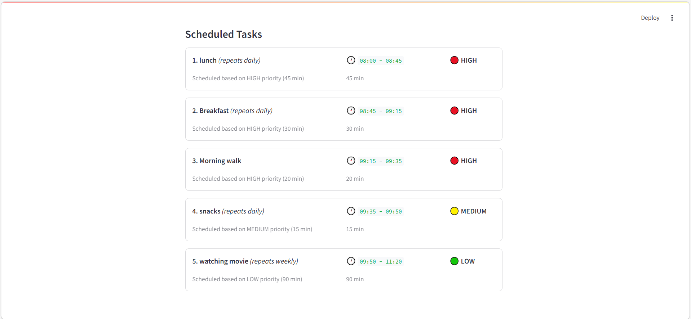
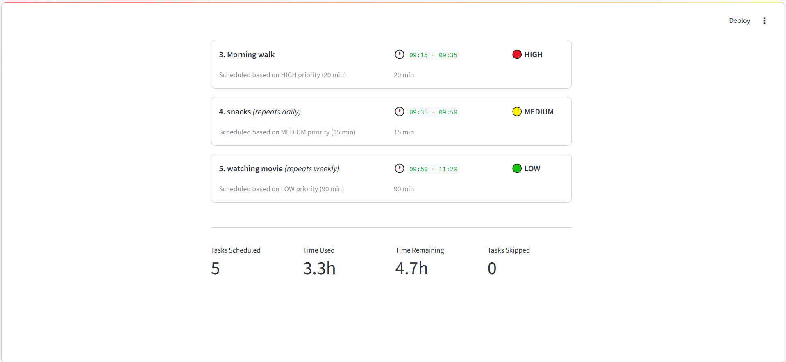

# PawPal+ (Module 2 Project)

**PawPal+** is a smart pet care scheduling assistant built with Python and Streamlit. It helps busy pet owners manage daily care tasks across multiple pets, automatically generating optimized schedules based on priority, time constraints, and task recurrence.

## 📸 Demo

<!-- <a href="/course_images/ai110/uml_final.png" target="_blank"></a> -->







## ✨ Features

### Smart Scheduling Algorithms

- **Priority-Based Sorting** — Tasks are ranked HIGH → MEDIUM → LOW using a weighted sort. When available time is limited, the scheduler greedily fits the most important tasks first, dropping lower-priority ones rather than truncating the schedule arbitrarily.

- **Chronological Display** — After scheduling, `sort_by_time()` reorders the plan by clock time using lexicographic sorting on zero-padded 24-hour time slots (`08:00 - 08:30`), so the daily plan always reads in order from morning to evening.

- **Conflict Detection** — `detect_conflicts()` checks every pair of scheduled tasks for overlapping time slots using `itertools.combinations`. If two tasks overlap, a warning banner appears in the UI with details — the system warns instead of crashing, keeping the owner informed.

- **Recurring Tasks** — Tasks can be set to repeat `ONCE`, `DAILY`, or `WEEKLY`. When a recurring task is marked complete, `mark_completed()` automatically generates the next occurrence with the correct due date using Python's `timedelta`, so nothing falls through the cracks.

- **Time Constraint Enforcement** — The scheduler respects the owner's available hours per day. Tasks that won't fit are excluded from the plan and counted in the "Tasks Skipped" metric shown after scheduling.

### UI Features

- Add tasks with name, duration, priority, and repeat frequency
- Per-row delete button (🗑️) to remove individual tasks
- Conflict warning banner with expandable detail view
- Recurrence badges on scheduled task cards (`repeats daily`, `repeats weekly`)
- Summary metrics: tasks scheduled, time used, time remaining, tasks skipped

## Scenario

A busy pet owner needs help staying consistent with pet care. They want an assistant that can:

- Track pet care tasks (walks, feeding, meds, enrichment, grooming, etc.)
- Consider constraints (time available, priority, owner preferences)
- Produce a daily plan and explain why it chose that plan

## Smarter Scheduling

Run `python main.py` to see all scheduling features in action in the terminal.

## Testing PawPal+

### Run the test suite

```bash
python -m pytest tests/test_pawpal.py -v
```

### What the tests cover

The suite contains **41 tests** across 8 test classes:

| Area                 | Tests | Description                                                                                                                                                    |
| -------------------- | ----- | -------------------------------------------------------------------------------------------------------------------------------------------------------------- |
| `Task`               | 6     | Creation, completion, skipping, resetting, and getter methods                                                                                                  |
| `Pet`                | 6     | Adding/removing tasks, filtering by priority, pending-task queries                                                                                             |
| `Owner`              | 4     | Pet management and aggregating tasks across all pets                                                                                                           |
| `Scheduler`          | 5     | Plan generation, priority ordering, time-constraint enforcement, empty-pet edge case                                                                           |
| `Integration`        | 2     | Full owner → pet → task → schedule workflow and task lifecycle                                                                                                 |
| `Sorting`            | 5     | `sort_by_time()` returns tasks in chronological order; handles empty lists, single items, and does not mutate the original                                     |
| `Recurrence`         | 6     | `mark_completed()` generates the correct next-occurrence date for DAILY/WEEKLY tasks, returns `None` for ONCE tasks, and leaves the new task in PENDING status |
| `Conflict Detection` | 7     | `detect_conflicts()` flags identical and overlapping slots; correctly ignores adjacent (touching) tasks; reports all pairs when multiple conflicts exist       |

### Confidence Level

**5 / 5**

The scheduler's three core intelligent behaviors - chronological sorting, recurring task generation, and conflict detection - are each verified across happy paths and boundary edge cases. The greedy time-constraint fitting and priority ordering are also covered. No tests were found failing against the current implementation.

## Getting started

### Setup

```bash
python -m venv .venv
source .venv/bin/activate  # Windows: .venv\Scripts\activate
pip install -r requirements.txt
```

### Suggested workflow

1. Read the scenario carefully and identify requirements and edge cases.
2. Draft a UML diagram (classes, attributes, methods, relationships).
3. Convert UML into Python class stubs (no logic yet).
4. Implement scheduling logic in small increments.
5. Add tests to verify key behaviors.
6. Connect your logic to the Streamlit UI in `app.py`.
7. Refine UML so it matches what you actually built.
