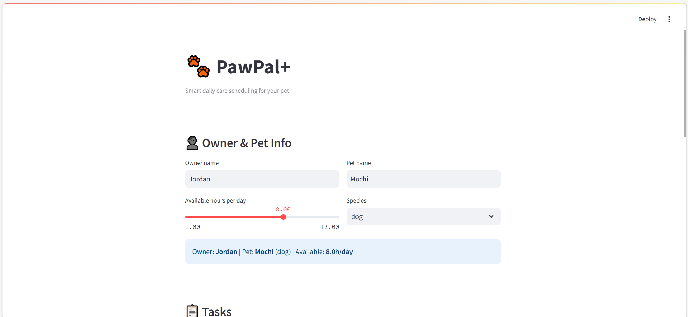
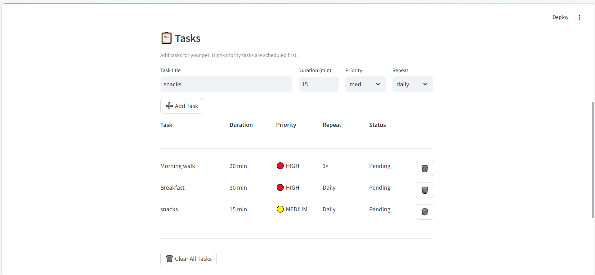
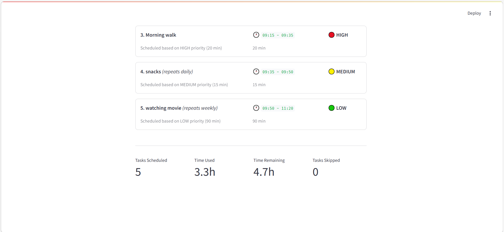
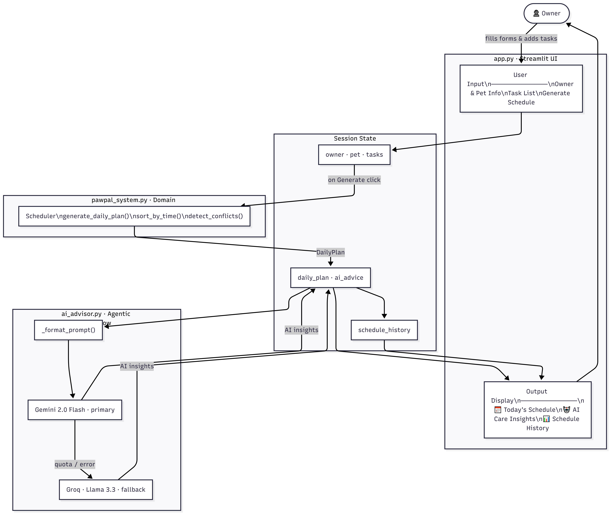

# PawPal+ · Applied AI System Project

## Original Project

PawPal+ (Modules 1–3) is a Python pet care scheduling assistant. It generates daily plans for pet owners based on task priority, available time, and recurrence. Core classes: `Owner`, `Pet`, `Task`, `Scheduler`, `DailyPlan`.

---

## What It Does Now

Adds an AI layer - after generating a schedule, the app sends the full context to a language model and returns specific, actionable care recommendations for that pet. Includes a **schedule history** for comparing plans across multiple pets.

---

## Demo







---

## Architecture Overview



- **`app.py`** - Streamlit UI. Collects input, triggers scheduling, displays results and history.
- **`pawpal_system.py`** - Pure Python scheduling engine. Priority-based task ordering, sequential time slot assignment, conflict detection.
- **`ai_advisor.py`** - Agentic workflow. Builds a structured prompt → tries Gemini 2.0 Flash → falls back to Groq/Llama 3.3 on failure. Logs all requests to `pawpal_ai.log`.
- **Session State** - Holds owner, pet, tasks, plan, AI advice, and schedule history across reruns.

---

## Setup

```bash
git clone <your-repo-url>
cd applied-ai-system-project
python -m venv .venv
source .venv/bin/activate   # Windows: .venv\Scripts\activate
pip install -r requirements.txt
cp .env.sample .env         # Add API_KEY and GROQ_API_KEY
streamlit run app.py
```

**API keys needed (both free):**

- Google AI Studio → [aistudio.google.com](https://aistudio.google.com)
- Groq → [console.groq.com](https://console.groq.com)

---

## Sample Interactions

### Mochi (dog) - 8 tasks, 8h available

> _"Mochi's schedule is densely packed. The 60-minute grooming session could cause stress - consider splitting it. Replace the evening walk with extended playtime for better mental stimulation. The 2.8h of unused time could support additional exercise."_

### Justin (cat) - 7 tasks, 8h available

> _"Justin's schedule is well-structured. However, cats aren't typically walked on leashes — replace the morning walk with playtime. Add a scratching post session to support claw health and natural instincts."_

### Multi-pet comparison

|                 | Mochi (dog) | Justin (cat) |
| --------------- | ----------- | ------------ |
| Tasks scheduled | 8           | 7            |
| Time used       | 5.2h        | 6.3h         |
| Remaining       | 2.8h        | 1.7h         |

---

## Design Decisions

- **Agentic workflow** - The prompt includes actual scheduled tasks, skipped tasks, conflicts, species, and available hours so advice is data-driven, not generic.
- **Gemini + Groq fallback** - Gemini hits quota limits on the free tier. Groq picks up automatically so the feature never silently fails.
- **Domain logic separate from UI** - `pawpal_system.py` has no Streamlit imports, making it fully testable without mocking.
- **Sequential time slots** - Tasks run from 08:00 AM in priority order. The scheduler doesn't know "Dinner" belongs in the evening - known limitation, documented.

---

## Testing

42 tests, all passing. Covers task lifecycle, priority ordering, insertion-order tiebreaking, time constraints, conflict detection, recurrence, and sorting edge cases.

Gap: `ai_advisor.py` has no unit tests — the prompt builder and fallback logic depend on live API calls. Would mock these in a production system.

---

## AI Reliability

| Method               | Detail                                                                                                            |
| -------------------- | ----------------------------------------------------------------------------------------------------------------- |
| Logging              | Every request and response logged to `pawpal_ai.log` with timestamps and full error messages                      |
| Fallback chain       | Gemini 2.0 Flash → Groq (Llama 3.3) - automatically engaged when Gemini hit free-tier quota limits during testing |
| Human review         | 3 AI outputs reviewed across dog and cat schedules - advice was species-specific and schedule-aware in all cases  |
| Hallucination caught | AI claimed a schedule "exceeded available time" when metrics showed 1.7h remaining - caught through human review  |

**Summary:** The fallback chain worked as expected - Groq engaged automatically every time Gemini failed. 2 out of 3 AI outputs gave accurate, useful recommendations. One hallucination was caught through human review, which is why the app always shows raw schedule metrics alongside AI output - so users can verify the advice themselves.

---

## Reflection

Making AI feel reliable took more work than getting it to respond. Quota errors, prompt design, logging failures - that's where the time went. The bigger lesson: AI output needs the same scrutiny as a code review. It removed "unused" imports that weren't unused, and claimed a schedule exceeded available time when it didn't. Treat suggestions as a starting point, not a final answer.

---

## Ethics

**Limitations and biases**
All tasks schedule from 08:00 AM sequentially - "Dinner" can end up at 10:00 AM. AI advice is based on general species knowledge, not breed or health history, so it can sound confident while being wrong for a specific animal.

**Could it be misused?**
Someone might follow AI care advice without a vet, especially for meds or diet. A simple disclaimer - "not a substitute for veterinary advice" - would be enough to set the right expectation.

**What surprised me**
The hallucination. The AI said a schedule "exceeded available time" when 1.7h was clearly remaining. It was confident and wrong. Showing the raw metrics next to the AI output was the right call - users can see for themselves.

**AI collaboration**
Helpful: During UML review, the AI flagged that `ScheduledTask` was missing as a class and suggested adding enums (`Priority`, `TaskStatus`, `Frequency`). Good catch before any code was written.

Flawed: The AI removed imports from `app.py` because the linter flagged them as unused - they weren't. Caught it by reading the diff before accepting. "Linter says unused" and "actually unused" are not the same thing.

---

## Future Development

- **RAG:** Let the AI reference real pet care guides and vet articles instead of relying on general training knowledge - so advice is breed-specific and verifiable.
- **Multi-pet scheduling:** One combined daily plan for all pets, so the owner can spot clashes like two pets needing a walk at the same time.
- **Time-of-day preferences:** Let users tag tasks as Morning, Afternoon, or Evening so Dinner doesn't end up at 10 AM.
