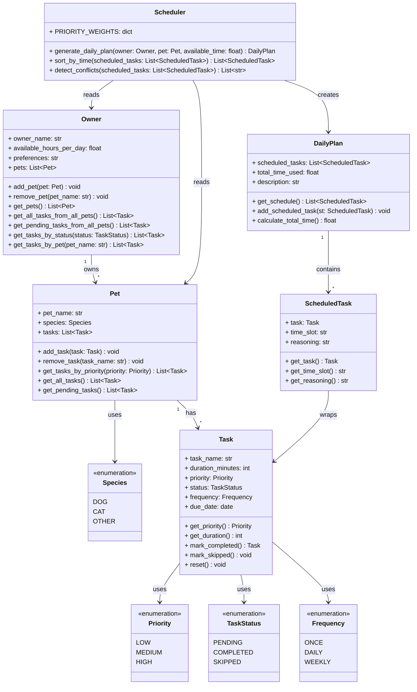

# PawPal+ Project Reflection

## 1. System Design

**a. Initial design**

- Briefly describe your initial UML design.
  My initial design was to create five classes **Owner, Pet, Task, Scheduler and DailyPlan**. _Owner_ can have multiple pets. _Pet_ will have list of tasks, and _Scheduler_ organizes these components to generate daily schedule.
- What classes did you include, and what responsibilities did you assign to each?
  **Owner**: This class is the pet owner. Contains the owner name, pet collection, defining constraints like hours availability and preferences.
  **Pet**: This class will have attributes of pet name, species, list of tasks assigned to the pet and methods like getTasksByPriority().
  **Task**: This class with have the attributes of task name, task duration and task priority - _LOW, MEDIUM and High_.
  **Scheduler**: This will be responsible for organizing the schedule based on the constraints - _Owner, Pet, and Task_.  
  **DailyPlan**: This will have list of tasks - with assigned time slot and task description.

  **UML Diagram:**

  ```mermaid
  classDiagram
    class Owner {
      - ownerName: str
      - availableHoursPerDay: float
      - preferences: str
      - pets: List~Pet~
      + addPet(pet: Pet) void
      + removePet(petName: str) void
      + getPets() List~Pet~
    }

    class Pet {
      - petName: str
      - species: str
      - tasks: List~Task~
      + addTask(task: Task) void
      + removeTask(taskName: str) void
      + getTasksByPriority(priority: str) List~Task~
      + getAllTasks() List~Task~
    }

    class Task {
      - taskName: str
      - durationMinutes: int
      - priority: str
      + getPriority() str
      + getDuration() int
    }

    class Scheduler {
      + generateDailyPlan(owner: Owner, pet: Pet, availableTime: float) DailyPlan
      - sortTasksByPriority(tasks: List~Task~) List~Task~
      - checkTimeConstraints(tasks: List~Task~, availableTime: float) bool
    }

    class DailyPlan {
      - scheduledTasks: List~ScheduledTask~
      - totalTimeUsed: float
      - description: str
      + getSchedule() List~ScheduledTask~
    }

    class ScheduledTask {
        - task: Task
        - timeSlot: str
        - reasoning: str
        + getTask() Task
        + getTimeSlot() str
        + getReasoning() str
    }

    Owner "1" --> "*" Pet : owns
    Pet "1" --> "*" Task : has
    Scheduler --> DailyPlan : creates
    DailyPlan "*" --> "1..*" ScheduledTask : contains
    ScheduledTask --> Task : references
  ```

**Updated UML Diagram (Final Implementation):**



**b. Design changes**

- Did your design change during implementation?
  Yes, several refinements were identified during code skeleton review and implementation planning.
- If yes, describe at least one change and why you made it.

  **Change 1**: Removed the `getExplanation()` method and replaced it with a `description` attribute.

  **Why**: The description is generated once by the Scheduler and remains static. Storing it as an attribute is simpler and more efficient than using a method.

  **Change 2 (Identified for future implementation)**: Code review revealed several features needed for production:
  - **Task Status**: Tasks need states (PENDING, COMPLETED, SKIPPED) to track progress through the day.
  - **Recurring Tasks**: "Morning walk" happens daily, but current model treats tasks as one-time only. Need `is_recurring` and `recurrence_pattern` fields.
  - **Date Tracking**: DailyPlan should store what date the schedule is for to support multi-day planning.
  - **Scheduler Scope**: Currently generates plan for one pet, but Owner has many. Should consider handling all pets simultaneously.

  **Decision**: These enhancements are identified but will be prioritized and added during implementation based on testing requirements.

  **Change 3 (Final Project)**: Added AI agentic workflow with Gemini 2.0 Flash (primary) and Groq/Llama 3.3 (fallback), schedule history for multi-pet comparison, and fixed equal-priority task ordering to preserve insertion order instead of sorting by duration.

---

## 2. Scheduling Logic and Tradeoffs

**a. Constraints and priorities**

- What constraints does your scheduler consider (for example: time, priority, preferences)?
  I have created the Scheduler that considers these constraints - **time**, **priority levels** and **task status**.
  -
  - **priority levels** with _HIGH_, _MEDIUM_ and _LOW_ levels determine the order of tasks to be scheduled.
  - **task status** - scheduling only Pending tasks.

- How did you decide which constraints mattered most?
  Time and priority are the most important ones and focused on it.

**b. Tradeoffs**

- Describe one tradeoff your scheduler makes.
  I have used the `detect_conflicts()` method to check the task pair for overlaps but gets slower as the task increases.
- Why is that tradeoff reasonable for this scenario?
  It can able to handle few tasks per pet.

---

## 3. AI Collaboration

**a. How you used AI**

- How did you use AI tools during this project (for example: design brainstorming, debugging, refactoring)?
  For this project, I have used Claude AI for every phases. I used it to review my initial UML design and able to identify missed classes like the
  _ScheduledTask_ and enums like _TaskStatus_, _Frequency_ and _Priority_. By adding the test cases, able to identify the behaviors and edge cases. Refactoring the code for the features - scheduling features, conflicts and sorting. In the final project phase, I integrated Gemini 2.0 Flash with a Groq fallback for the AI advisor and added schedule history to compare plans across multiple pets.
- What kinds of prompts or questions were most helpful?
  I used direct questions and generated responses was clear. For example, _What are the most important edge cases for a scheduler with sorting and recurring tasks ?_

**b. Judgment and verification**

- Describe one moment where you did not accept an AI suggestion as-is.
  The interesting moment is that, when the AI removed the some classes from the imports in _app.py_. I stopped and asked why it has been removed before accepting the code and it gave the response that the **Linter** flagged them as unused so it removed them. I want to understand the code used line by line and then accept it.
- How did you evaluate or verify what the AI suggested?
  For evey code change, I read and understand the code before accepting it. I executed **pytest** each time to make sure that everything is working. And I have to check the UML diagram to ensure that it matched the actual code.

---

## 4. Testing and Verification

**a. What you tested**

- What behaviors did you test?
  I tested priority sorting, recurring task generation, conflict detection, time constraint enforcement, and empty pet handling. I also added a test to verify that equal-priority tasks maintain insertion order after fixing the secondary sort that was causing tasks to reorder by duration.
- Why were these tests important?
  These are the important behaviors of the scheduler. A bug in any of the feature would produce a wrong schedule result without no Python error.

**b. Confidence**

- How confident are you that your scheduler works correctly?
  5 out of 5. All 42 tests pass including edge cases.
- What edge cases would you test next if you had more time?
  Tasks spanning past midnight, two pets sharing the same task name, and an owner with zero available hours.

---

## 5. Reflection

**a. What went well**

- What part of this project are you most satisfied with?
  Separting the domain logic - **pawpal_system.py** and UI - **app.py**. Scheduling logic does not have any Streamlit dependencies which made tests and codebase easy to maintain.

**b. What you would improve**

- If you had another iteration, what would you improve or redesign?
  Currently the scheduler works for one pet at a time. I would like to improve it to handle all the pets together in a single schedule and saved the schedule so it does not reset the when the page refreshes.

**c. Key takeaway**

- What is one important thing you learned about designing systems or working with AI on this project?
  AI is an important and great tool for speeding the work but cannot make design decisions. I also learnt that it is very important to review the AI fgenerated suggestions before accepting it.
